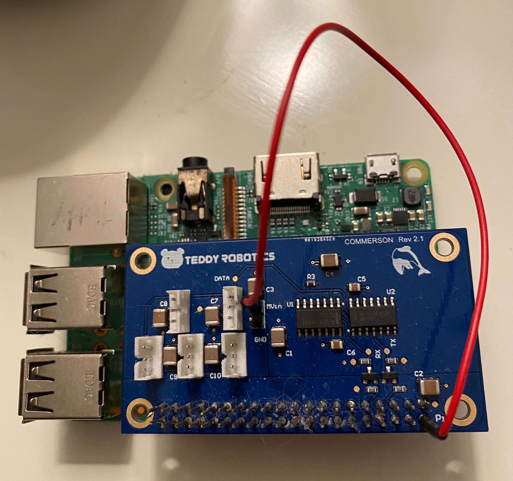

# Commerson-Driver
A python driver for our Commerson board that communicates with our servo motors

## Installation
 
`pip install -r requirements.txt`
We need to make some modifications to your pi in order for this to work:
```sudo nano /boot/config.txt``` 
and add the line `enable_uart=1` 
Then 
```sudo nano /boot/cmdline.txt``` 
and DELETE the entry `console=ttyAMA0,115200` 

 
## Usage
 
Moving a motor:
```
from commerson_driver import CommersonDriver
if __name__ == '__main__':
    driver = CommersonDriver() #assign object to driver
    motor_id = 12 #define motor ID
    angle = 150 #define angle to move to
    speed = 0.5 #speed
    driver.move_motor(motor_id, angle, speed) #move motor function
```

## Notes

Must have jump a wire from MVin pin to 5V power from Raspberry Pi (as depicted in image below).



If you are getting a no serial port found error, then switch between /dev/ttyS0 and /dev/ttyAMA0 in commerson_driver.py.

## License
 
The MIT License (MIT)

Copyright (c) 2019 Teddy Robotics LLC

Permission is hereby granted, free of charge, to any person obtaining a copy of this software and associated documentation files (the "Software"), to deal in the Software without restriction, including without limitation the rights to use, copy, modify, merge, publish, distribute, sublicense, and/or sell copies of the Software, and to permit persons to whom the Software is furnished to do so, subject to the following conditions:

The above copyright notice and this permission notice shall be included in all copies or substantial portions of the Software.

THE SOFTWARE IS PROVIDED "AS IS", WITHOUT WARRANTY OF ANY KIND, EXPRESS OR IMPLIED, INCLUDING BUT NOT LIMITED TO THE WARRANTIES OF MERCHANTABILITY, FITNESS FOR A PARTICULAR PURPOSE AND NONINFRINGEMENT. IN NO EVENT SHALL THE AUTHORS OR COPYRIGHT HOLDERS BE LIABLE FOR ANY CLAIM, DAMAGES OR OTHER LIABILITY, WHETHER IN AN ACTION OF CONTRACT, TORT OR OTHERWISE, ARISING FROM, OUT OF OR IN CONNECTION WITH THE SOFTWARE OR THE USE OR OTHER DEALINGS IN THE SOFTWARE.
